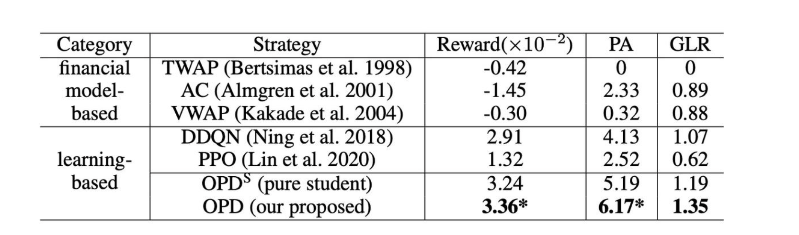

### **1. Problem Background and Challenges**  

- **Market Impact**: Large trades may trigger adverse price movements.  
- **Price Risk**: Slow execution may miss favorable price windows.  

**Traditional methods** (e.g., the Almgren-Chriss model) rely on strict market assumptions (e.g., prices following Brownian motion), but real-world markets are complex and dynamic, limiting their practicality.  
**Reinforcement Learning methods** bypass market assumptions but face challenges:  
- **Noisy Data**: Leads to low sample efficiency.  
- **Imperfect Information**: Only historical data is available; future information is unknown.  

**Objective Function**: Maximize the
$$\arg\max_{q_1,q_2,\ldots,q_T}\sum_{t=0}^{T-1}(q_{t+1}\cdot p_{t+1}),s.t.\sum_{t=0}^{T-1}q_{t+1}=Q.$$
- $q_t$: Quantity traded at timestep $t$.
- $p_t$: Market price at timestep $t$.
- $Q$: Total quantity to be traded.

---
 
### **2. MDP Formulation for Order Execution**  
Order execution is modeled as a **Markov Decision Process (MDP)**:  
- **State**: 
  - private variables (remaining inventory, elapsed time)
  - public variables (historical market data, e.g., open prices, trading volumes).  
- **Action**: 
  - The proportion of assets to trade at each step $a_t$, 
  - constrained by $\sum_{t=0}^{T-1} a_t = 1$.  
- **Reward**: 
  - **Price Advantage**: Measures trading gains relative to the market average price(across the trading period, no information leakage).  
  - **Market Impact Penalty**: Penalizes adverse price effects from large trades.  

**Reward Function**:  
$$\hat{R}_t^+(\boldsymbol{s}_t,a_t)=\frac{q_{t+1}}{Q}\cdot\overbrace{\left(\frac{p_{t+1}-\tilde{p}}{\tilde{p}}\right)}^{\text{price normalization}}=a_t\left(\frac{p_{t+1}}{\tilde{p}}-1\right)$$

$$\hat{R}_t^-=-\alpha(a_t)^2$$

$$
R_t = \hat{R}_t^+ + \hat{R}_t^-$$  

- $p_{t+1}$: Market price at the next timestep.  
- $\tilde{p}$: Average market price over the execution window (contains future information, since reward fucntion is not in state, no information leakage).  
- $\alpha$: Penalty coefficient controlling trade size impact (only temporary, market is resilient, price bounce bakct at next timestep).  
  
**Objective Function**: 
$$\arg\max_\pi\mathbb{E}_\pi\left[\sum_{t=0}^{T-1}\gamma^tR_t(\boldsymbol{s}_t,a_t)\right].$$
- $\pi$: Policy function. Decides the action of trading volume at each timesteps.

---
### **3. Policy Distillation Framework**  

A **teacher-student framework** addresses imperfect information:  
- **Teacher Policy**: Trained with perfect information (including future prices) via RL to generate optimal strategies.  
- **Student Policy**: Accesses only historical data and learns generalized strategies by mimicking the teacher.  

**Training Process**:  

**Loss Function**: Combines policy loss $L_p$), value function loss $L_v$), and distillation loss $L_d$):  
$$
L(\theta) = L_p + \lambda L_v + \mu L_d$$  

- **Policy Loss ($L_p$)**: Maximizes expected rewards by adjusting policy parameters.
- **Value Function Loss ($L_v$)**: Minimizes the difference between predicted and actual state values.
$$L_v(\boldsymbol{\theta})=\mathbb{E}_t\left[\|V_{\boldsymbol{\theta}}(\boldsymbol{s}_t)-V_t\|_2\right]$$
$$V_t=\sum_{t^{\prime}=t}^{T-1}\mathbb{E}\left[\gamma^{T-t^{\prime}-1}R_{t^{\prime}}(s_{t^{\prime}},a_{t^{\prime}})\right]$$
you can imagine this is the reward value of future timesteps using monte carlo simulation.
- **Distillation Loss ($L_d$)**: Aligns student and teacher policies to enhance generalization.
$$L_d=-\mathbb{E}_t\left[\log\Pr(a_t=\tilde{a}_t|\pi_{\boldsymbol{\theta}},\boldsymbol{s}_t;\pi_{\boldsymbol{\phi}},\tilde{\boldsymbol{s}}_t)\right]$$
**Network Architecture**:  
- **Recurrent Neural Network (RNN)** processes sequential market data.  
- Shared-parameter networks output both action distributions (Actor) and state values (Critic).  

---

### **4. Experiments and Results**  
#### **4.1 Experimental Setup**  
- **Dataset**: Minute-level trading data from China’s A-share market (2017–2019), covering 3,569 assets.  

#### **4.2 Evaluation Metrics**  
1. **Reward**: Mean cumulative reward.  
2. **Price Advantage (PA)**: Return improvement over market average (basis points, BP).  
3. **Gain-Loss Ratio (GLR)**: Ratio of positive to negative returns.  
$$\begin{aligned}
 & \text{price advantage (PA)}=\frac{10^4}{|\mathbb{D}|}\sum_{k=1}^{|\mathbb{D}|}(\frac{\bar{P}_{\mathrm{strategy}}^k}{\tilde{p}^k}-1) \\
 & \text{gain-loss ratio (GLR)}=\frac{\mathbb{E}[\mathrm{PA|PA>0}]}{\mathbb{E}[\mathrm{PA|PA<0}]}
\end{aligned}$$

#### **4.3 Results**  

---

